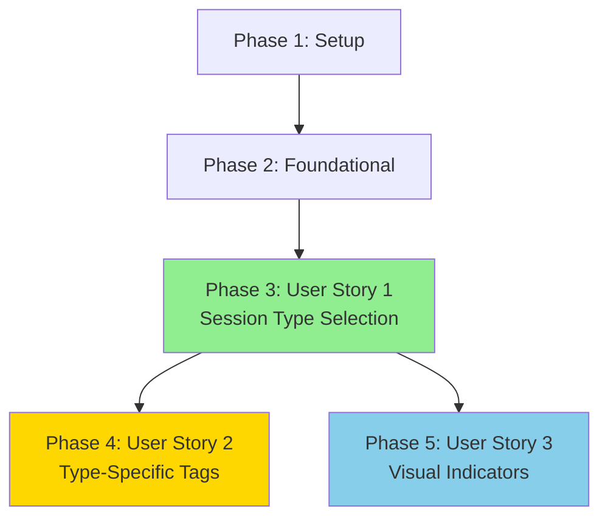

# Implementation Tasks: Session Type Classification

**Feature**: 003-session-typing
**Branch**: `003-session-typing`
**Date**: 2025-11-18
**Status**: Ready for Implementation

## Overview

This document contains the complete task breakdown for implementing session type classification. Tasks are organized by user story to enable independent implementation and testing. Each user story represents a shippable increment of functionality.

**Implementation Strategy**: MVP-first, incremental delivery
- **MVP Scope**: User Story 1 only (Session Type Selection)
- **Incremental**: Add User Story 2, then User Story 3
- **Each story is independently testable and delivers user value**

---

## Task Summary

- **Total Tasks**: 29
- **User Story 1 (P1)**: 13 tasks (MVP)
- **User Story 2 (P1)**: 7 tasks
- **User Story 3 (P2)**: 6 tasks
- **Setup Phase**: 1 task
- **Foundational Phase**: 2 tasks
- **Polish Phase**: 0 tasks (no cross-cutting concerns)

**Parallel Opportunities**: 14 tasks marked [P] (48% parallelizable)

---

## Phase 1: Setup

**Goal**: Initialize project structure and dependencies

**Tasks**:

- [X] T001 Verify development environment has Node.js 18+, TypeScript 5.9.3, Vue 3.5.24, Vite 7.2.2 installed

---

## Phase 2: Foundational (Blocking Prerequisites)

**Goal**: Establish shared types and utilities needed by all user stories

**Tasks**:

- [X] T002 [P] Create SessionType model with union type, validation, and normalization in src/models/SessionType.ts
- [X] T003 [P] Update Event model to define RPG_TAGS and BOARDGAME_TAGS constants in src/models/Event.ts

**Why Foundational**: All user stories depend on SessionType definition and tag constants

**Independent Test**: TypeScript compilation succeeds with no errors

---

## Phase 3: User Story 1 - Session Type Selection (Priority: P1)

**Story Goal**: Users can create sessions by clicking one of two dedicated type buttons (🎲 RPG or 🎯 Boardgame)

**Why This Priority**: Foundation for all session typing features - without type selection, no other stories can function

**Independent Test Criteria**:
1. Open session creation form → two type buttons (🎲 RPG and 🎯 Boardgame) visible alongside name field
2. Enter name, click RPG button (🎲) → session created with type="RPG" in IndexedDB
3. Enter name, click Boardgame button (🎯) → session created with type="Boardgame" in IndexedDB
4. Click type button without entering name → validation error, session not created
5. Refresh browser → session type persists correctly

**Delivers User Value**: Users can organize sessions by game type from creation

### Database & Models

- [X] T004 [US1] Update Session model interface to add `type: SessionType` field in src/models/Session.ts
- [X] T005 [US1] Upgrade IndexedDB schema to v2 with `type` index and migration logic in src/services/db.ts

### Services & Business Logic

- [X] T006 [US1] Update `createSession` function to accept `type` parameter and validate it in src/composables/useSessionStore.ts
- [X] T007 [US1] Update `loadSessions` function to normalize session types using `normalizeSessionType()` in src/composables/useSessionStore.ts

### UI Components

- [X] T008 [US1] Remove `newSessionType` ref and update form validation to check for session name in SessionSelector.vue script section
- [X] T009 [US1] Add two dedicated buttons (🎲 RPG and 🎯 Boardgame) with icons and tooltips to session creation form in SessionSelector.vue template
- [X] T010 [US1] Update form submission handler to accept type parameter and validate session name in SessionSelector.vue
- [X] T011 [US1] Update `handleCreateSession` to accept type parameter and pass it to `createSession()` in SessionSelector.vue

### Internationalization

- [X] T012 [P] [US1] Add sessionType translation keys (label, rpg, boardgame, required, addRpg, addBoardgame) to src/locales/en.json
- [X] T013 [P] [US1] Add sessionType translation keys (label, rpg, boardgame, required, addRpg, addBoardgame) to src/locales/fr.json

### Integration & Testing

- [X] T014 [US1] Manually test session creation with RPG type → verify type persists in IndexedDB
- [X] T015 [US1] Manually test session creation with Boardgame type → verify type persists in IndexedDB
- [X] T016 [US1] Manually test form validation prevents submission without type selection

**User Story 1 Complete**: Users can create typed sessions with mandatory type selection ✅

---

## Phase 4: User Story 2 - Type-Specific Event Tags (Priority: P1)

**Story Goal**: Event tagging interface displays tags appropriate for the active session's type

**Why This Priority**: Core value proposition of session typing - users need relevant tags for their game type

**Dependencies**: Requires User Story 1 (sessions must have types)

**Independent Test Criteria**:
1. Create RPG session, activate it → event logger displays: Combat, Roleplay, Downtime, Scoring, Meal, Other
2. Create Boardgame session, activate it → event logger displays: Setup, Turn, Round, Scoring, Teardown, Other
3. Switch from RPG session to Boardgame session → tags update in <1 second
4. Switch from Boardgame session to RPG session → tags update in <1 second

**Delivers User Value**: Users see contextually relevant event tags for their game type

### Utilities & Mappings

- [X] T017 [P] [US2] Create `getTagsForSessionType` function with SESSION_TYPE_TAGS mapping in src/utils/sessionTypeTags.ts

### UI Components

- [X] T018 [US2] Add computed property `availableTags` using `getTagsForSessionType()` in EventLogger.vue script
- [X] T019 [US2] Update tag buttons template to loop over `availableTags` instead of hardcoded array in EventLogger.vue

### Internationalization

- [X] T020 [P] [US2] Add eventTag translation keys (combat, roleplay, downtime, scoring, meal, other, setup, turn, round, teardown) to src/locales/en.json
- [X] T021 [P] [US2] Add eventTag translation keys (combat, roleplay, downtime, scoring, meal, other, setup, turn, round, teardown) to src/locales/fr.json

### Integration & Testing

- [X] T022 [US2] Manually test RPG session displays correct 6 tags (Combat, Roleplay, Downtime, Scoring, Meal, Other)
- [X] T023 [US2] Manually test Boardgame session displays correct 6 tags (Setup, Turn, Round, Scoring, Teardown, Other)

**User Story 2 Complete**: Users see type-appropriate event tags based on active session ✅

---

## Phase 5: User Story 3 - Visual Session Type Indicators (Priority: P2)

**Story Goal**: Session list displays icons with hover tooltips to visually distinguish session types

**Why This Priority**: UX enhancement - users can quickly identify session types at a glance

**Dependencies**: Requires User Story 1 (sessions must have types)

**Independent Test Criteria**:
1. Create multiple RPG and Boardgame sessions
2. View session list → each RPG session shows 🎲 icon, each Boardgame session shows 🎯 icon
3. Hover over 🎲 icon → tooltip displays "RPG" (English) or "JdR" (French)
4. Hover over 🎯 icon → tooltip displays "Boardgame" (English) or "Jeu de plateau" (French)
5. Switch language → tooltips translate correctly

**Delivers User Value**: Users can visually scan and identify session types without reading names

### UI Components

- [X] T024 [P] [US3] Add `getSessionTypeIcon` helper function that returns emoji (🎲 for RPG, 🎯 for Boardgame) in SessionSelector.vue script
- [X] T025 [US3] Add session type icon `<span>` with tooltip attributes to session list items in SessionSelector.vue template
- [X] T026 [US3] Apply CSS styling to `.session-type-icon` class for proper sizing and spacing in SessionSelector.vue styles

### Integration & Testing

- [X] T027 [US3] Manually test RPG sessions display 🎲 icon with "RPG" tooltip in English
- [X] T028 [US3] Manually test Boardgame sessions display 🎯 icon with "Boardgame" tooltip in English
- [X] T029 [US3] Switch to French language → verify tooltips show "JdR" and "Jeu de plateau"

**User Story 3 Complete**: Users can visually distinguish session types via icons with tooltips ✅

---

## Dependency Graph



**Critical Path**: Setup → Foundational → User Story 1 → User Story 2 → User Story 3

**Parallel Branches**: User Story 2 and User Story 3 can be developed in parallel after User Story 1 completes

---

## Parallel Execution Opportunities

### Phase 2: Foundational (All Parallel)
```bash
# T002 and T003 can run simultaneously (different files, no dependencies)
[T002] Create SessionType.ts
[T003] Update Event.ts
```

### Phase 3: User Story 1

**Parallel Set 1** (After T005 completes):
```bash
# Database migration must complete before any of these
[T006] Update useSessionStore createSession
[T007] Update useSessionStore loadSessions
[T008] Add SessionSelector refs
[T012] Update en.json
[T013] Update fr.json
```

**Sequential After Parallel Set 1**:
```bash
[T009] Add type selector to form (depends on T008)
[T010] Add form validation (depends on T008, T009)
[T011] Update submission handler (depends on T006, T010)
[T014-T016] Manual testing (depends on all implementation tasks)
```

### Phase 4: User Story 2

**Parallel Set 1** (After T017 completes):
```bash
[T018] Add availableTags computed (depends on T017)
[T020] Update en.json
[T021] Update fr.json
```

**Sequential**:
```bash
[T019] Update template (depends on T018)
[T022-T023] Manual testing (depends on all implementation)
```

### Phase 5: User Story 3

**Parallel Set 1** (All parallel):
```bash
[T024] Add icon helper function
[T025] Add icon span to template
[T026] Add CSS styling
```

**Sequential**:
```bash
[T027-T029] Manual testing (depends on all implementation)
```

---

## Implementation Strategy

### MVP Delivery (User Story 1 Only)

**Goal**: Ship minimal viable feature - users can create sessions with types

**Tasks**: T001-T016 (16 tasks, ~3 hours)

**Value Delivered**:
- Session type selection during creation
- Type validation and persistence
- Database migration for existing sessions
- Internationalized UI labels

**Not Included in MVP**:
- Type-specific event tags (User Story 2)
- Visual session type icons (User Story 3)

**MVP Test**:
1. Create RPG session → stored with type="RPG"
2. Create Boardgame session → stored with type="Boardgame"
3. Validation prevents creation without type
4. Existing sessions migrated to type="RPG"
5. Type persists across browser restarts

### Incremental Delivery (User Story 2)

**Goal**: Add core session typing value - contextual event tags

**Tasks**: T017-T023 (7 tasks, ~1.5 hours)

**Value Delivered**:
- RPG sessions show RPG-specific tags
- Boardgame sessions show Boardgame-specific tags
- Tags update when switching sessions

**Test**:
1. RPG session → Combat, Roleplay, Downtime, Scoring, Meal, Other
2. Boardgame session → Setup, Turn, Round, Scoring, Teardown, Other
3. Switch between sessions → tags update correctly

### Final Delivery (User Story 3)

**Goal**: Add UX polish - visual session type identification

**Tasks**: T024-T029 (6 tasks, ~1 hour)

**Value Delivered**:
- Icons distinguish session types at a glance
- Tooltips aid discoverability
- Accessible via screen readers

**Test**:
1. RPG sessions → 🎲 icon with "RPG" tooltip
2. Boardgame sessions → 🎯 icon with "Boardgame" tooltip
3. Language switching → tooltips translate

---

## Risk Management

### Risk 1: Database Migration Failure

**Impact**: High (data loss, app crash)
**Mitigation**: Task T005 includes idempotent migration with console logging
**Rollback**: Downgrade IndexedDB to v1, remove type field

### Risk 2: Tag List Doesn't Update When Switching Sessions

**Impact**: Medium (confusing UX, wrong tags displayed)
**Mitigation**: Task T018 uses Vue `computed()` for automatic reactivity
**Test**: Task T023 specifically validates tag switching

### Risk 3: Type Selection Not Translated

**Impact**: Low (English-only users unaffected)
**Mitigation**: Tasks T012-T013, T020-T021 add all translations upfront
**Test**: Task T029 validates French translations

---

## Success Criteria Mapping

| Success Criterion | Validated By Tasks |
|-------------------|-------------------|
| SC-001: Users can create sessions with type and see appropriate tags | T014-T016 (US1), T022-T023 (US2) |
| SC-002: 100% of Boardgame sessions display correct tag list | T023 (US2) |
| SC-003: Users can visually distinguish session types in list | T027-T028 (US3) |
| SC-004: Session type persists across application restarts | T014-T015 (US1) |
| SC-005: Tag list updates in <1 second when switching sessions | T023 (US2) |

---

## Notes for Implementation

### Code Quality Standards

- **TypeScript**: All new code must compile with strict mode, no `any` types
- **Vue 3**: Use Composition API, `computed()` for derived state, `ref()` for reactive state
- **Internationalization**: All user-facing text must use `$t()` or `t()` for translation
- **Accessibility**: All icons must have `role="img"` and `aria-label` attributes
- **Testing**: Manual testing checklist provided per user story

### Performance Targets

- **Session creation**: Type selection adds <50ms overhead (T004-T011)
- **Tag list switch**: <1 second update when changing sessions (T018-T019)
- **Bundle size**: <20KB gzipped increase (no new dependencies added)

### Troubleshooting Guide

**Issue**: TypeScript error "Property 'type' does not exist on Session"
**Solution**: Ensure T004 completed before T006-T007, rebuild TypeScript

**Issue**: Migration doesn't run
**Solution**: Delete IndexedDB in DevTools → Application → IndexedDB, reload page

**Issue**: Tags don't update when switching sessions
**Solution**: Verify T018 uses `currentSession.value.type` (with `.value`)

**Issue**: Tooltips not showing
**Solution**: Verify T012-T013 keys exist in locale files, check browser console for i18n warnings

---

## Completion Checklist

- [ ] All 29 tasks marked complete in this file
- [ ] TypeScript compiles with no errors (`npm run build`)
- [ ] ESLint passes with no warnings (`npm run lint`)
- [ ] All manual tests pass for each user story
- [ ] Database migration tested with existing data
- [ ] Both English and French translations working
- [ ] Session types persist across browser restarts
- [ ] No console errors or warnings in browser DevTools
- [ ] Code review requested and approved
- [ ] Feature branch merged to main

---

**Task Breakdown Complete**: 2025-11-18
**Ready for Implementation**: Yes
**Estimated Total Time**: 5.5 hours (MVP: 3 hours)
**Next Command**: `/speckit.implement` to begin implementation
